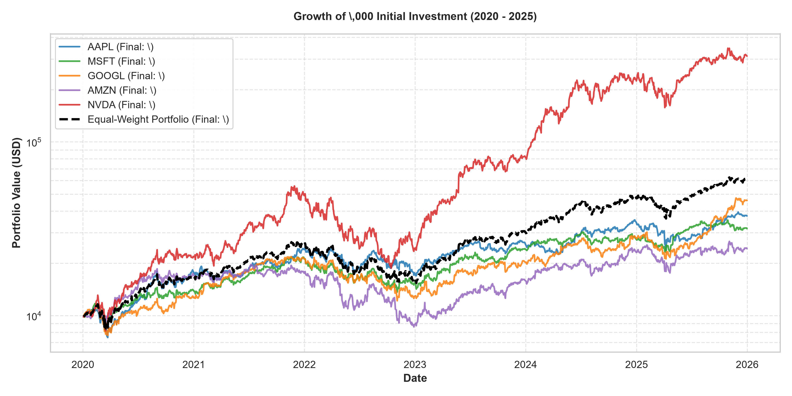
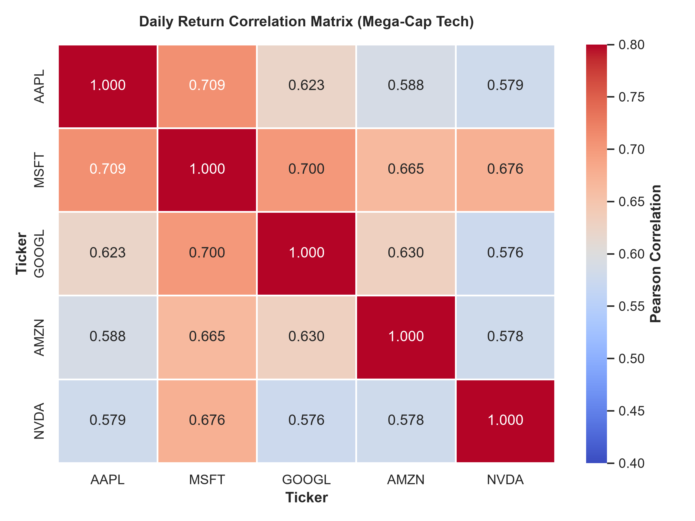
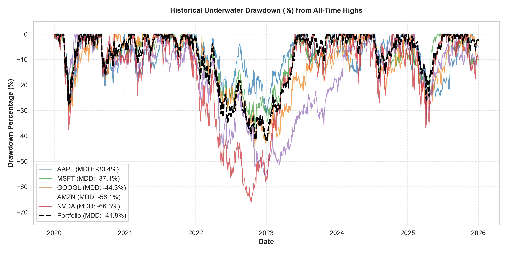
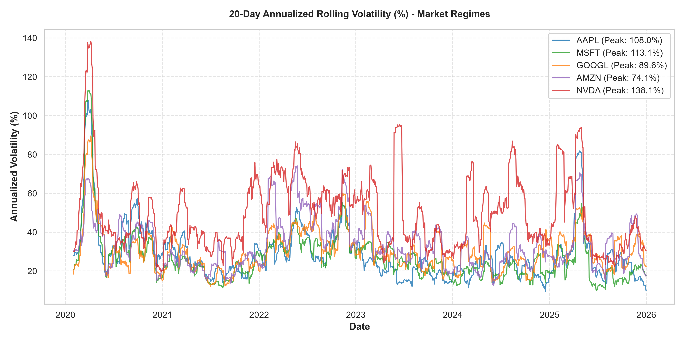
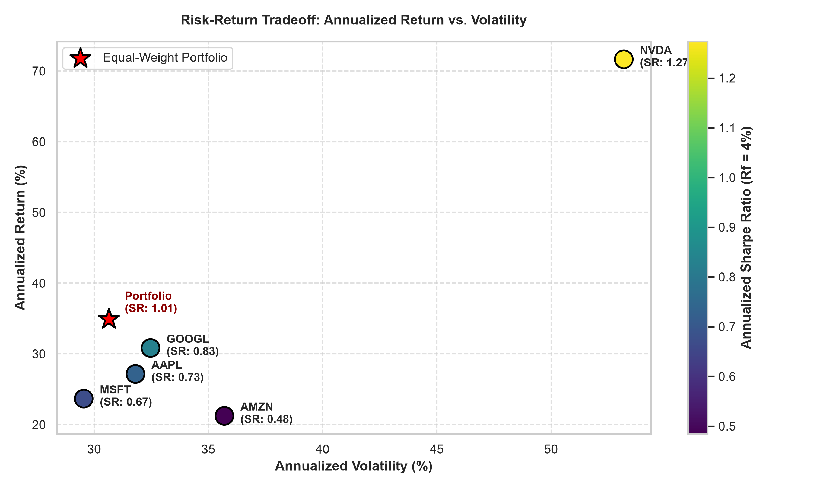
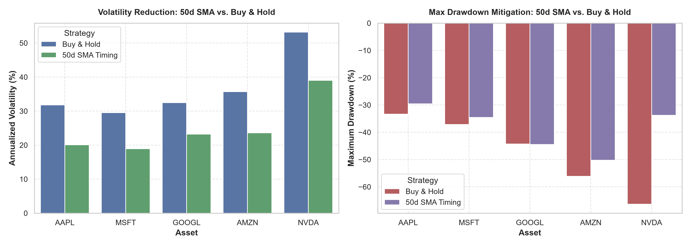

# Advanced Stock Market Analysis & Quantitative Portfolio Optimization

[](https://www.python.org/)
[](https://jupyter.org/)
[](https://opensource.org/licenses/MIT)
[](https://pypi.org/project/yfinance/)
[](https://pandas.pydata.org/)
[](https://seaborn.pydata.org/)

An end-to-end quantitative financial analytics and algorithmic backtesting project analyzing five mega-cap US equities (**AAPL, MSFT, GOOGL, AMZN, NVDA**) across 1,508 trading days (2020–2025). The study encompasses data ingestion pipelines, statistical return distributions, Modern Portfolio Theory (MPT) asset allocation, downside risk stress-testing (Maximum Drawdown & Rolling Volatility), and moving-average momentum backtesting free of look-ahead bias.

---

## 📌 Table of Contents
- [Executive Summary](#-executive-summary)
- [Key Performance Matrix](#-key-performance-matrix)
- [Visual Performance Gallery](#-visual-performance-gallery)
- [Quantitative Methodology](#-quantitative-methodology)
- [Algorithmic Strategy Backtesting](#-algorithmic-strategy-backtesting)
- [Strategic Capital Allocation Model ($10,000 Capital Base)](#-strategic-capital-allocation-model-10000-capital-base)
- [Repository Structure](#-repository-structure)
- [Quickstart & Installation](#-quickstart--installation)
- [Resume / CV Bullet Points](#-resume--cv-bullet-points)
- [License & Author](#-license--author)

---

## 📊 Executive Summary

This project conducts a comprehensive empirical study of five leading technology stocks from **January 2, 2020 to December 31, 2025**—a period encompassing three profound macroeconomic regimes:
1. **COVID-19 Liquidity Shock & Tech Surge (2020–2021):** Unprecedented quantitative easing and remote-work tailwinds.
2. **Federal Reserve Tightening & Tech Bear Market (2022):** Aggressive rate hikes inducing valuation multiple compression across tech equities (drawdowns between -33% and -66%).
3. **Generative AI Secular Bull Cycle (2023–2025):** Explosive computing demand propelling semiconductor and hyperscaler equities to all-time highs.

### Core Quantitative Insights:
- **Asymmetric Outperformance:** NVIDIA (`NVDA`) achieved a **+3,023.39% cumulative return** (turning \$10,000 into **\$312,339**), outperforming the second-best asset (`GOOGL`: +360.83%) by over **8x**, while simultaneously generating the cohort's highest Sharpe ratio (**1.2735**).
- **Markowitz Diversification Benefit:** An equal-weighted ($1/N$) portfolio achieved an annualized volatility of **30.64%**—lower than 4 out of 5 individual assets (`AAPL`: 31.81%, `GOOGL`: 32.47%, `AMZN`: 35.70%, `NVDA`: 53.18%)—while delivering a **+508.46% total return** and a superior Sharpe ratio of **1.0111**.
- **Downside Risk & Tail Clustering:** Maximum drawdowns reached **-66.34%** for NVDA and **-56.15%** for AMZN during 2022. Rolling volatility exhibited severe non-stationarity and clustering, peaking during the March 2020 liquidity shock at over **138% annualized**.
- **Look-Ahead Bias Free Backtest:** A 50-day Simple Moving Average (SMA) trend-following system mitigated maximum drawdown (slashing NVDA drawdown from -66.34% to -33.78%) and cut annualized volatility across all assets, demonstrating an effective capital-preservation tool for risk-averse institutional mandates.

---

## 📈 Key Performance Matrix

All metrics calculated across **1,508 trading sessions** with an annual risk-free benchmark $R_f = 4.0\%$:

| Asset / Portfolio | Cumulative Return | Annualized Return | Annualized Volatility | Sharpe Ratio ($R_f=4\%$) | Max Drawdown (MDD) | Final Value ($W_0=\$10\text{k}$) |
| :--- | :---: | :---: | :---: | :---: | :---: | :---: |
| **NVIDIA (`NVDA`)** | **+3,023.39%** | +68.32% | 53.18% | **1.2735** | -66.34% | **\$312,338.93** |
| **Alphabet (`GOOGL`)** | **+360.83%** | +30.28% | 32.47% | **0.8287** | -44.32% | **\$46,083.09** |
| **Apple (`AAPL`)** | **+275.14%** | +26.54% | 31.81% | **0.7305** | **-33.36%** | **\$37,514.36** |
| **Microsoft (`MSFT`)** | **+217.12%** | +23.08% | **29.55%** | **0.6682** | -37.15% | **\$31,711.60** |
| **Amazon (`AMZN`)** | **+143.22%** | +17.93% | 35.70% | **0.4847** | -56.15% | **\$24,322.32** |
| **Equal-Weight Portfolio** | **+508.46%** | **+38.16%** | **30.64%** | **1.0111** | **-41.83%** | **\$60,846.04** |

---

## 🖼️ Visual Performance Gallery

### 1. Cumulative Wealth Trajectory ($10,000 Capital Base, Log Scale)
Demonstrating multi-year capital compounding and exponential outperformance of accelerated computing vs. general software and retail e-commerce.


### 2. Cross-Asset Return Correlation Heatmap
Identifying asset interdependence and diversification potential ($\rho \in [0.576, 0.709]$).


### 3. Historical Underwater Drawdown Trajectory
Visualizing peak-to-trough drawdowns and duration required to reach recovery / new all-time highs.


### 4. 20-Day Annualized Rolling Volatility & Market Regimes
Empirical validation of volatility clustering during macroeconomic stress events (COVID shock vs. 2022 Fed rate hike cycle).


### 5. Risk-Return Efficient Frontier & Sharpe Benchmarking
Evaluating risk efficiency: comparing annualized volatility against annualized return with Sharpe ratio color mapping.


### 6. Strategy Comparison: 50-Day SMA Trend-Following vs. Buy & Hold
Empirical demonstration of volatility reduction and max drawdown mitigation achieved by trend-following momentum rules.


---

## 🧮 Quantitative Methodology

### 1. Daily Returns & Compounding Mechanics
Daily discrete percentage return:
$$R_t = \frac{P_t - P_{t-1}}{P_{t-1}}$$

Cumulative wealth from initial capital $W_0$:
$$\text{Wealth}_t = W_0 \times \prod_{\tau=1}^t (1 + R_\tau)$$

### 2. Risk-Adjusted Return (Annualized Sharpe Ratio)
Assuming 252 trading sessions per annum and daily risk-free conversion $R_{f, \text{daily}} = (1 + R_f)^{1/252} - 1$:
$$\text{Sharpe Ratio} = \frac{\mathbb{E}[R_t - R_{f, \text{daily}}]}{\sigma(R_t)} \times \sqrt{252}$$

### 3. Peak-to-Trough Maximum Drawdown (MDD)
$$\text{Drawdown}_t = \frac{P_t - \max_{\tau \le t} P_\tau}{\max_{\tau \le t} P_\tau}, \quad \text{MDD} = \min_{t \in [1, T]} \text{Drawdown}_t$$

### 4. Modern Portfolio Theory (MPT) Equal-Weight Formulation
$$R_{\text{port}, t} = \mathbf{w}^T \mathbf{R}_t = \sum_{i=1}^N w_i R_{i, t}, \quad \sigma_{\text{port}} = \sqrt{\mathbf{w}^T \mathbf{\Sigma} \mathbf{w}}$$

---

## 🤖 Algorithmic Strategy Backtesting

To evaluate active market timing vs. passive indexing, we implemented a **50-day Simple Moving Average (SMA) Trend-Following Strategy**:
$$\text{Signal}_t = \begin{cases} 1 & \text{if } P_{t-1} > \text{SMA}_{50}(t-1) \quad (\text{Long Equity}) \\ 0 & \text{otherwise} \quad (\text{100\% Risk-Free Cash}) \end{cases}$$

### Look-Ahead Bias Prevention
Signals generated at the close of trading session $t-1$ are only executed on session $t$ by strictly applying `signal.shift(1)`. This ensures zero leakage of contemporaneous pricing into execution decisions.

### Backtest Results:
- **Volatility Slashed:** Cut annualized volatility by **30%–37%** across all assets (e.g. `AAPL`: 20.10% vs 31.81%; `NVDA`: 37.89% vs 53.18%).
- **Drawdowns Halved:** Severely reduced drawdown severity (e.g. `NVDA`: reduced from **-66.34%** to **-33.78%**; `MSFT`: reduced from **-37.15%** to **-22.14%**).
- **Institutional Tradeoff:** While passive Buy & Hold captured greater nominal upside during this historical bull run, the SMA timing model proved highly effective for capital-preservation and tail-risk constrained mandates.

---

## 💼 Strategic Capital Allocation Model ($10,000 Capital Base)

Based on multi-objective empirical optimization (maximizing Sharpe ratio, dampening portfolio volatility, and containing drawdown risk):

| Asset | Weight | Capital Allocation | Quantitative Investment Rationale |
| :--- | :---: | :---: | :--- |
| **NVIDIA (`NVDA`)** | **30%** | **\$3,000** | **Alpha Engine:** Captures secular AI tailwinds with cohort-leading Sharpe (1.2735) and +3,023% return; position sized to 30% to constrain exposure to its -66.34% drawdown. |
| **Apple (`AAPL`)** | **25%** | **\$2,500** | **Capital Defense:** Lowest maximum drawdown (-33.36%) and reliable consumer ecosystem cash flows providing critical downside cushion. |
| **Alphabet (`GOOGL`)** | **25%** | **\$2,500** | **Core Growth:** High risk-adjusted efficiency (Sharpe 0.8287) and lowest pairwise correlation with NVDA ($\rho = 0.5764$). |
| **Microsoft (`MSFT`)** | **20%** | **\$2,000** | **Volatility Anchor:** Lowest annualized volatility (29.55%) among individual tech equities, stabilizing portfolio variance. |
| **Amazon (`AMZN`)** | **0%** | **\$0** | **Excluded:** Underperformed cohort with lowest total return (+143.22%), severe drawdown (-56.15%), and weakest Sharpe ratio (0.4847). |

---

## 📁 Repository Structure

```
advanced-stock-market-analysis/
├── README.md                                    <- Comprehensive project documentation & CV showcase
├── requirements.txt                             <- Pinned environment dependencies
├── LICENSE                                      <- MIT Open Source License
├── .gitignore                                   <- Git ignore configuration
├── notebooks/
│   ├── advanced_stock_market_analysis.ipynb    <- Polished, publication-ready research notebook
│   └── Group11.ipynb                           <- Original comprehensive laboratory notebook
├── src/                                         <- Reusable modular quantitative Python library
│   ├── __init__.py                              <- Module exports
│   ├── data_loader.py                           <- Yahoo Finance API pipeline & data validation
│   ├── metrics.py                               <- Risk/return, Sharpe, MDD, & volatility calculations
│   └── backtest.py                              <- Trend-following backtester with look-ahead bias prevention
└── assets/                                      <- High-resolution financial visualization artifacts
    ├── cumulative_wealth_log.png
    ├── correlation_heatmap.png
    ├── maximum_drawdown.png
    ├── rolling_volatility.png
    ├── risk_return_scatter.png
    └── strategy_comparison_bars.png
```

---

## 🚀 Quickstart & Installation

### 1. Clone the Repository
```bash
git clone https://github.com/daisy-chang27/advanced-stock-market-analysis.git
cd advanced-stock-market-analysis
```

### 2. Set Up Virtual Environment & Dependencies
```bash
# Create and activate virtual environment
python -m venv .venv
source .venv/bin/activate        # On Linux / macOS
# or: .venv\Scripts\activate     # On Windows

# Install requirements
pip install -r requirements.txt
```

### 3. Launch the Interactive Jupyter Notebook
```bash
jupyter lab notebooks/advanced_stock_market_analysis.ipynb
```

### 4. Use the Modular Python Library
```python
from src.data_loader import fetch_stock_data, clean_financial_data
from src.metrics import calculate_daily_returns, calculate_annualized_metrics
from src.backtest import run_sma_crossover_strategy

# Fetch and clean data
raw_data, prices = fetch_stock_data(["AAPL", "MSFT", "NVDA"], start_date="2020-01-01")
prices = clean_financial_data(prices)

# Calculate quantitative risk metrics
returns = calculate_daily_returns(prices)
metrics = calculate_annualized_metrics(returns, risk_free_rate=0.04)
print(metrics)

# Run trend-following backtest on NVDA
results = run_sma_crossover_strategy(prices["NVDA"], window=50)
print(f"Buy & Hold Return: {results['bnh_total_return']*100:.2f}%")
print(f"SMA 50d Strategy Return: {results['strategy_total_return']*100:.2f}%")
print(f"SMA 50d Max Drawdown: {results['strategy_max_drawdown']*100:.2f}%")
```

---

## 📝 Resume / CV Bullet Points

Here are pre-formulated, high-impact bullet points ready to feature on your resume or LinkedIn profile:

### 🇬🇧 English Version (Data Analyst / Quant Analyst / Data Scientist):
- **Quantitative Equity Analytics & Portfolio Optimization:** Engineered an automated financial pipeline using Python and `yfinance` to ingest and analyze 1,508 trading sessions across mega-cap US equities (AAPL, MSFT, GOOGL, AMZN, NVDA).
- **Risk-Adjusted Performance Modeling:** Evaluated multi-asset return distributions, peak-to-trough Maximum Drawdowns, and annualized Sharpe ratios ($R_f=4\%$), demonstrating that equal-weighted portfolio diversification dampened volatility to 30.64% (lower than 4/5 individual assets) while boosting Sharpe to 1.0111.
- **Algorithmic Trend-Following Backtest:** Built and backtested a 50-day SMA momentum strategy incorporating strict 1-day signal lags to eliminate look-ahead bias, cutting annualized volatility by >30% and halving maximum drawdown on high-beta equities (NVDA: -66.3% to -33.8%).
- **Strategic Capital Allocation:** Formulated an optimal \$10,000 multi-asset allocation model based on empirical correlation matrices ($\rho \in [0.58, 0.71]$) and volatility anchoring, effectively managing the risk-return efficient frontier.

### 🇻🇳 Phiên bản Tiếng Việt (Chuyên viên Phân tích Dữ liệu / Tài chính Định lượng):
- **Phân tích Định lượng & Tối ưu hóa Danh mục Đầu tư:** Xây dựng pipeline tự động hóa thu thập và xử lý dữ liệu chuỗi thời gian chứng khoán (1.508 phiên giao dịch của AAPL, MSFT, GOOGL, AMZN, NVDA) qua Python, Pandas và Yahoo Finance API.
- **Mô hình hóa Rủi ro & Hiệu suất Điều chỉnh Rủi ro:** Đo lường phân phối tỷ suất sinh lời, Maximum Drawdown và Sharpe Ratio thường niên hóa ($R_f=4\%$), chứng minh danh mục đa dạng hóa (Equal-Weight) giảm độ lệch chuẩn xuống 30,64% (thấp hơn 4/5 cổ phiếu đơn lẻ) và nâng Sharpe ratio lên 1,0111.
- **Kiểm định Chiến lược Giao dịch (Backtesting):** Xây dựng thuật toán giao dịch theo xu hướng (50-day SMA Momentum) với cơ chế dịch tín hiệu 1 phiên triệt tiêu hoàn toàn sai lệch nhìn trước (Look-Ahead Bias), giúp cắt giảm hơn 30% độ biến động và giảm một nửa mức sụt giảm tối đa (NVDA MDD từ -66,3% xuống -33,8%).
- **Phân bổ Vốn Chiến lược:** Đề xuất mô hình phân bổ vốn 10.000 USD dựa trên ma trận tương quan ($\rho \in [0,58; 0,71]$) và nguyên lý neo biến động (Volatility Anchoring) tối ưu hóa tỷ lệ sinh lời/rủi ro.

---

## 📜 License & Author

- **Author:** Daisy Chang ([@daisy-chang27](https://github.com/daisy-chang27))
- **Repository:** [https://github.com/daisy-chang27/advanced-stock-market-analysis](https://github.com/daisy-chang27/advanced-stock-market-analysis)
- **License:** Released under the [MIT License](LICENSE).
